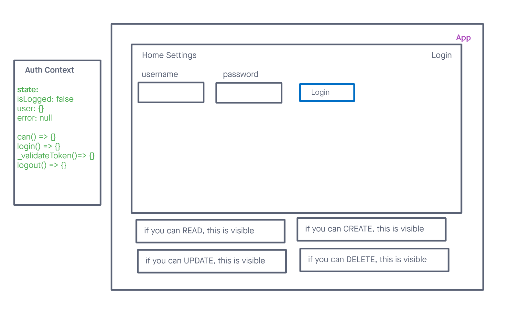

# documentation

Global state is consumed on a few different levels on this application. first it is being consumed in the the list to determine the number of items to display. second it is being consumed on the header to determine the number of incomplete items.

The use form hook is being used as a form in the application that can render both the form and the other components it needs to render such as the list it is also being used to set global states from form input such as the items and the list so that other components can use them.

## class 32

## class 33

today we are implementing RBC role bas3ed control and authorization adn the ability to log in.

we will be adding an additional context file in the app and add contexts needed for users and for RBC. We will also be implementing conditionally rendered components where depending on the users capabilities that will determine what they can see or what they can do i.e. editing a list item or deleting a list item.

still working on understanding how to do tests for this content.

## class 34

today we are implementing the use of an api and gaining full crud capabilities through the use of axios and RBC to be able to create new users sign into those users and create data that will persist in a database.
